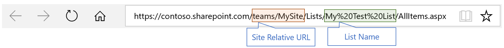

# Get a SharePoint List via PowerShell using Microsoft Graph API
This sample PowerShell script demonstrate how to get  SharePoint List Items/fieds via PowerShell using the Microsoft Graph API via REST.

## 1. Download Microsoft Authentication Library (MSAL) Library
This sample requires MSAL.NET library for obtaining an Access Token used to query the Microsoft Graph API. Because PowerShell does not have direct integration with nuget, follow the instructions for manual downloading MSAL.NET:

1. Go to https://www.nuget.org/packages/Microsoft.Identity.Client and select 'Manual Download' to download the MSAL `nupkg` file.
2. Rename the file extension to .zip 
3. Extract the zip file to `{path}\packages\Microsoft.Identity.Client.1.1.0-preview` - where `{path}` is the folder where your script is saved

## 2. Register an Application
You need to register an application to be able to access the Microsoft Graph API. In order to do this:

1. Go to https://apps.dev.microsoft.com/portal/register-app
2. Add a name for the application and make sure the *Guided Setup* option is **unchecked**
3. Click `Create`
4. Now configure the new application to be a `Native App` by clicking `Add Platforms`, selecting `Native Application` and then click `Save`
5. Copy the Guid under `Application Id` to the clipboard

## 3. Configure your PowerShell Script

1. Open your PowerShell script and replace the `YourAppIdHere` with the Application Id for your application you just registered
2. Now add your Site Relative URL and the List Name by replacing the values of `YourSiteRelativeUrlHere` and `YourListNameHere`

```PowerShell
##Please replace the three values below
$appId = "YourAppIdHere" 
$SiteRelativeUrl = "YourSiteRelativeUrlHere"
$ListName = "YourListNameHere"
```

> #### What is my _Site Relative URL_ and my _List Name_?
> Open your SharePoint List in a browser, then check the image below to find out the values for _Site Relative URL_ and your  _List Name_. For the list name, can use both URL encoded with _%20_ or spaces:
> 

## 4. Run your script

Start a PowerShell session then run the script:

```powershell
.\PS-SharePoint-List-Graph.ps1
```